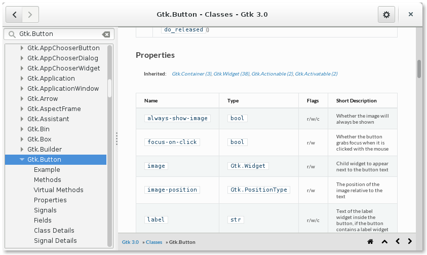

Automated Documentation Generation
==================================

One of the major drawbacks of the new GObject Introspection system compared to
old static bindings like `pygtk <http://www.pygtk.org/>`__ from a developer
perspective is the lack of documentation. The importance of good documentation
became obvious while watching the PyGObject support channels during the
implementation of PGI as many of the questions asked there were regarding the
Python API and missing documentation.

The automation the documentation generation was already a goal of the GObject
Introspection project as the annotation scanner also extracts the accompanying
comments and puts them into the GIR XML file. On the other hand they don't get
included into the typelib file and are thus not accessible through the
libgirepository API at runtime. The following XML snippet shows the meta data
of the ``gtk_button_set_label()`` method including documentation:

.. code-block:: xml

    <method name="get_label" c:identifier="gtk_button_get_label">
      <doc xml:whitespace="preserve">Fetches the text from the label of the button, as set by
        gtk_button_set_label(). If the label text has not 
        been set the return value will be %NULL. This will be the 
        case if you create an empty button with gtk_button_new() to 
        use as a container.

        by the widget and must not be modified or freed.</doc>
      <return-value transfer-ownership="none">
        <doc xml:whitespace="preserve">The text of the label widget. This string is owned</doc>
        <type name="utf8" c:type="gchar*"/>
      </return-value>
    </method>

For automatic documentation generation the GI project already contains a tool,
called "g-ir-doctool", which uses the XML data to generate HTML documentation
for Python, but the results are not complete and error-prone and thus the user
still has to look up documentation of the C library and manually verify the
interfaces with the Python interpreter. This state is the result of various
shortcomings of the used generation approach. First the documentation syntax
used in the C code is a form of Markdown mixed with Docbook XML. The main
consumer for the documentation and the implementation is "gtk-doc", which is
written in Perl. To get the same output as "gtk-doc" one has to closely follow
its implementation and "g-ir-doctool" does not implement a compatible parser
to get the same output. Furthermore not all the needed information is included
in the used GIR XML. Some information like property descriptions and property
default values can only be retrieved from the C code or at runtime through the
GObject API. And finally in some cases PyGObject changes the exposed Python
interfaces, either because the function is not usable through GObject
Introspection and is implemented through the CPython C API or in case the API
was extended to make it easier to use or for backwards compatibility.

To produce sound and complete documentation we've looked into a different
approach by using the Python bindings as main source of the documentation.

PGI-Docgen - Documentation Through Runtime Introspection
--------------------------------------------------------

To fix all the previously mentioned problems and provide a complete and sound
documentation for PyGObject developers, PGI-Docgen was created. Instead of
using the GIR XML as input, PGI-Docgen introspects the API exposed by PGI and
only uses the GIR XML to pull in the documentation text. Compared to
PyGObject, PGI exposes additional interfaces needed for documentation
generation (see :numref:`docgen` for an overview). This has the advantage that
the documentation always shows the real interfaces of PGI and in cases where
PGI adjusts the API, for example through API overrides, the documentation
reflects those changes. Since the introspection happens at runtime all the
information available to the developer can be retrieved as well, like default
property values. Despite PGI not being feature complete its NULL backend
allows it to expose all possible APIs even in cases where it's missing
features for implementing them.

    Documentation Generation Process

To convert the retrieved information to HTML the `Sphinx documentation
generator <http://www.sphinx-doc.org/en/stable/>`__ is used which requires its
input to be `reST (reStructred Text)
<http://docutils.sourceforge.net/rst.html>`__. To match the formatting and
output of "gtk-doc", PGI-Docgen includes a Python port of the "gtk-doc"
parsing code which converts the code comments to DocBook XML. PGI-Docgen then
converts the DocBook XML to reST (Restructred Text) and parses the
non-formatting related text for references.

    Screenshot of the generated documentation describing the 
    *Gio.Application* class.

The resulting documentation can be viewed at
https://lazka.github.io/pgi-docs/#Gtk-3.0, see
:numref:`docs_example` for an example.

    The Devhelp documentation browser showing PGI-Docgen generated pages
    and the search index.

Furthermore the documentation provides the following features:

**Devhelp integration.** Devhelp, the official documentation browser of the
Gnome project provides a combined view of the documentation of all Gnome
projects. Making it possible to include the Python documentation reduces the
number of user interfaces a developer has to deal with. See
:numref:`pgi-docgen-devhelp` for how the Devhelp integrations looks like.

**Online and offline version.** Online documentation makes it easy to look up
documentation in cases were installation is not an option. Offline
documentation is needed for cases where an Internet connection is not
available or where low latency access is preferred.

**Local search.** It provides fast and configurable symbol search, which works
both in online and offline mode.

**Source Code Mapping.** It links Python functions to the location of the C
source implementation, allowing developers to see the actual implementation
in case the documentation is lacking.

Source Code Mapping
-------------------

In theory the provided documentation contains everything the developer would
need for understanding the behavior of a function. In reality the
documentation can be lacking due to missing information on error handling or
allowed value ranges. Another problem specific to GObject Introspection is
that the function annotations might be missing or wrong and as a result the
function exposes an unusable Python interface. To make it easy to look at the
C implementation of each function PGI-Docgen adds a link to each function
leading to the source code exposed in the respective online version control
repository browser, such as https://git.gnome.org.

For this to work we need the to fetch the debug information for each library,
which is provided by the `AutomaticDebugPackages project
<https://wiki.debian.org/AutomaticDebugPackages>`__ in Debian. With "objdump"
we can list all the exported symbols and their address:

::

    >>> objdump -t -j .text libgtk-3.so | grep -n1 "gtk_button_new$"
    11317-0000000000152b30 g     F .text	000000000000009a gtk_color_button_set_alpha
    11318:000000000012cb00 g     F .text	0000000000000019 gtk_button_new
    11319-00000000002be390 g     F .text	0000000000000274 gtk_selection_convert

Then iterating over the DWARF compile units we can find the nearest 
DW_TAG_subprogram to the exported symbol and the source file and line:

::

    >>> objdump --dwarf=info libgtk-3.so | grep -B8 12cb00
     <2><32b6a5>: Abbrev Number: 0
     <1><32b6a6>: Abbrev Number: 52 (DW_TAG_subprogram)
        <32b6a7>   DW_AT_external    : 1
        <32b6a7>   DW_AT_name        : (indirect string, offset: 0x18c92): gtk_button_new
        <32b6ab>   DW_AT_decl_file   : 1
        <32b6ac>   DW_AT_decl_line   : 1235
        <32b6ae>   DW_AT_prototyped  : 1
        <32b6ae>   DW_AT_type        : <0x326cfe>
        <32b6b2>   DW_AT_low_pc      : 0x12cb00
        <32b6ba>   DW_AT_high_pc     : 0x19

Wrapping this process in a Python library we can look up the source location
of symbols:

::

    >>> debug.get_line_numbers_for_name("libgtk-3.so")["gtk_button_new"]
    'gtk/gtkbutton.c:1235'

    The implementation source of "gtk_button_new", which can be reached by
    following the source link in the Python API documentation.

Combining the path information with the library version and a template for an
online git repository browser we can build an online source URL (see
:numref:`docgen_source`):

::

    >>> path = 'gtk/gtkbutton.c:1235'
    >>> Project.for_namespace("Gtk").get_source_func("Gtk")(path)
    'https://git.gnome.org/browse/gtk+/tree/gtk/gtkbutton.c?h=3.22.7#n1235'
