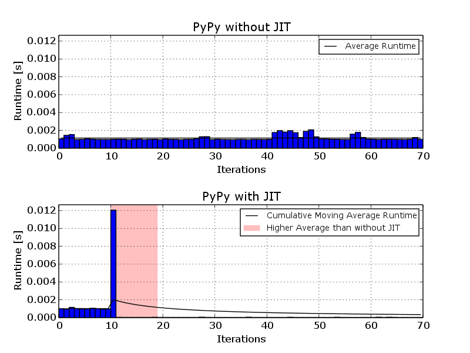
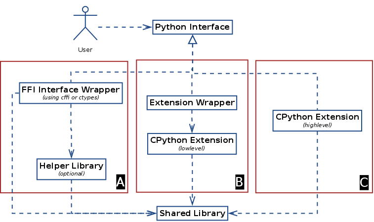
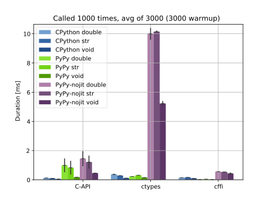
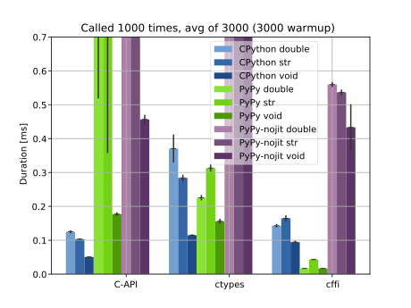

Bridging the Gap Between Python and C
=====================================

Integrating Python with other languages and runtimes is often required for
reusing existing libraries, frameworks and systems written in another
language. In case of CPython the common way to do this is to write an
extension module using the CPython C API which links against CPython and the
library one wants to interface with. Other Python interpreter implementations
like `Jython <http://www.jython.org/>`__, using the JVM (Java virtual
machine), and `IronPython <http://ironpython.net/>`__, using the CLR (Common
Language Runtime), in addition to interfacing with C libraries allow
integration with their respective runtime. For the CPython C-API there also
exist extension generators like `Cython <http://cython.org/>`__ and `SWIG
<http://www.swig.org/>`__ which try to make writing extension modules easier
using various approaches. Further more, Jython, IronPython, CPython and PyPy
implement, to some extend, the ctypes FFI interface for calling C libraries
using a Python interface. This chapter focuses only on integrating shared
libraries written in C because this is what the GObject system is written in.

The interface of a shared library can be divided into two parts, the API and
the ABI. The API (Application Programming Interface) is defined by the source
code and the set of exported symbols and varies between different libraries
and major library versions. The shared library itself doesn't include any API
information besides the set of exported symbols and their names. The ABI
(Application Binary Interface) is defined by the compiler and varies between
different compilers and the architecture the compiler is building for. Some
compilers also change this interface between compiler versions; for example
GCC and Clang provide a stable C ABI across compiler versions, MSVC does not.
When calling a function in a shared library, the API has to be considered for
the function name, which type need to be passed to it and which type it
returns. This information needs to be defined for each library by the
respective library binding. The ABI has to be considered for how to place the
passed values onto the stack, how to align them in memory and how to align
values in structures. This information needs to be defined for each compiler
and architecture and doesn't depend on the shared library used.

There currently exist two widely used approaches for writing Python bindings
by using the provided API of the shared library.

The first approach is writing an extension using the CPython C-API. The 
created extension links against the shared library and calls the functions 
according to the API defined by it. Since all involved components, the CPython 
API provider, the extension module and the shared library are written in C and 
compiled by the same compiler for the same architecture, the ABI used is the 
same across all interfaces. The CPython C-API is provided by CPython and, to 
some extend, by PyPy.

The second approach makes use of a, so called, foreign function interface
(FFI). The FFI provides functions for laying out values in memory and to call
functions in shared libraries while complying with the ABI and the calling
convention. One widely used implementation of such an interface is `libffi
<https://sourceware.org/libffi/>`__ for which bindings exist for CPython,
OpenJDK and various Ruby implementations etc. In case of CPython and PyPy this
interface can be accessed through the ``ctypes`` module included in the Python
standard library or the external ``cffi`` module.

The following sections will focus on evaluating the different approaches for 
interfacing with C libraries for the Python interpreter implementations 
CPython and PyPy.

Benchmarking Setup and Limitations
----------------------------------

All benchmarks and profiling runs performed in this paper were performed using
a Intel i7-2640M CPU with 8 GB RAM using Debian Stretch as an operating
system. The following software versions were used: Python 2.7.13, PyPy 5.6.0,
cffi 1.9.0 and PGI 0.0.11.1. All the source code for generating the results
and the plots should be accompanying this paper and can be modified or used to
replicate the results.

All benchmarks presented in this paper focus on a small interface or a simple
workload, so called micro benchmarks. They are not representative of real
world workloads where complex interactions between multiple workloads take
place. For the implementation of the benchmarks care has been taken to make
them reproducible, easy to run and easy to modify.

For comparing benchmark results of different Python interpreter
implementations their implementation characteristics have to be taken into
account. One such characteristic is the just in time (JIT) compiler which PyPy
implements. The PyPy JIT compiler will optimized the program execution if it
detects an often executed loop in the program. As this optimization process
changes the result depending on at which point in time during the execution
measurements are taken we want to either include or exclude it completely from
the results.

.. _jit_warmup:

    Two bechmark runs for calls to `strlen` using the cffi library.
    Once with the JIT disabled and once with the JIT enabled.

The graph :numref:`jit_warmup` illustrates the change of performance of
calling `strlen` 100 times using the cffi library. The first plot shows the
execution time with the JIT compiler disabled. The second plot shows the PyPy
JIT detecting a, so called, "hot loop" around the 10th iteration and
generating machine code for the trace which increases the runtime of that
iteration. The red shaded area indicates the period where the average runtime
is higher than without the JIT compiler showing that the optimization only
pays of after around 15 iterations and can even reduce performance for short
running programs. For long running programs the time until all the possible
optimizations for a specific workload are done is called "warmup time".

Because of these warmup effects the following benchmarks are grouped into two
groups (1) runtime performance benchmarks and (2) startup benchmarks. For the
runtime performance benchmarks the measurements start after the JIT compiler
is finished optimizing the running program and only the optimized execution is
recorded. This makes the results more representative of long running programs.
The startup benchmarks record the execution of the program including all the
warmup time.

Another difference between the CPython and PyPy is their memory management
strategy. While CPython uses reference counts, PyPy uses a tracing garbage
collector which periodically runs and can cause execution time peaks and extra
variance in the results.

PyPy provides various options for tuning the GC and the JIT for a specific
workload. For all benchmark runs in this paper no adjustments where made and
the default settings where used.

Library Wrapping Strategies
---------------------------

Python bindings for C libraries usually provide the following features on top 
of providing a Python interface:

* Hide memory management
* Validate input and output data and provide useful error messages with the
  goal that any misuse of the API results in a recoverable error and does
  not crash the program.
* Provide a Python class hierarchy for object oriented interfaces
* Translate various C error reporting schemes to Python exceptions.
  This includes among others, error codes, error flags in combination with a
  thread local error object or per call error objects.

These features can be implemented on different layers and the various
strategies of laying out the implementation can be roughly divided in three
groups, as visualized in diagram :numref:`wrappingfig`.

:A: Implement the interface in Python only using a FFI module.
:A/2: Optionally provide helper interfaces in a separate shared library linking
      to the wrapper shared library.
      Helpful for implementing things that are easier handled in C or
      for performance reasons.
:B: Implement a minimal Python interface using the CPython C API and implement 
    memory management, class hierarchies on top using Python.
:C: Implement the whole interface using the CPython C API.

While the resulting API is in on all three cases the same there can be
differences in performance, memory usage and code complexity.

There currently exist two implementations of application level foreign
function interfaces for Python, ctypes and cffi. *ctypes* is the built-in FFI
module shipped with the Python standard library and allows defining the C API
in Python, loading libraries, calling functions and passing callbacks etc. It
also exposes the CPython C API as a Python interface through the "pythonapi"
attribute. This feature is optional and not supported under PyPy. *cffi*
creates a Python interface by parsing C declarations. Compared to *ctypes* it
allows for ABI-level compatibility by compiling a helper library, which makes
the resulting module platform depended like with C-API extensions, but not
interpreter depended like CPython extensions.

And finally, to allow some degree of compatibility with CPython C extensions,
PyPy includes the `CPyExt
<https://bitbucket.org/pypy/pypy/src/default/pypy/module/cpyext/>`__ subsystem
which provides a compatibility layer for parts of the CPython C API. While it
is not ABI compatible with CPython, it is partly API compatible and allows
extensions to be recompiled against PyPy. CPyExt only implements a subset of
the CPython API and not all implemented functions are 100% compatible with
their CPython counterparts.

As an example, wrapping a simple C function ``size_t noop_str(char*);`` looks
as follows in ctypes:

.. code::

    import ctypes

    libnoop = ctypes.CDLL("libnoop.so")
    noop_str = libnoop.noop_str
    noop_str.argtypes = [ctypes.c_char_p]
    noop_str.restype =  ctypes.c_size_t

while under cffi:

.. code::

    import cffi

    ffi = cffi.FFI()
    ffi.cdef("""
    size_t noop_str(char*);
    """)
    libnoop = ffi.dlopen("libnoop.so")
    noop_str = libnoop.noop_str

and a CPython extension module:

.. code:: C

    #include <Python.h>
    #include <noop.h>

    static PyObject* cwrapper_noop_str(PyObject* self, PyObject* args)
    {
        char* raw_string;
        size_t out;

        if (!PyArg_ParseTuple(args, "s", &raw_string))
            return NULL;

        Py_BEGIN_ALLOW_THREADS;
        out = noop_str(raw_string);
        Py_END_ALLOW_THREADS;

        return PyInt_FromSize_t(out);
    }

    static PyMethodDef ctest_funcs[] = {
        {"noop_str", (PyCFunction)cwrapper_noop_str, 
         METH_VARARGS, ""},
        {NULL}
    };

    void initcwrapper(void)
    {
        Py_InitModule3("cwrapper", ctest_funcs, NULL);
    }

.. code::

    from cwrapper import noop_str

In all three examples the global interpreter lock (GIL) gets released during
the library call, which means other Python code can be executed concurrently
until the function returns.

Performance Comparison of Python Extensions Interfaces
------------------------------------------------------

With multiple wrapping interface options available we need to look at how they
compare performance wise under different scenarios. The goal is to get a
better understanding of the advantages and disadvantages of the various
approaches so can make better design decisions for the planned Python
bindings.

First we want to measure the overhead of calling functions in a shared library
from Python. This should give us a base line of the minimal overhead to expect
when building a Python interface.

For this benchmark three different functions with different argument types are
tested. ``bench_void()`` takes and returns no arguments, ``bench_str()`` is
similar to ``strlen()`` and takes a ``char*`` and returning a ``size_t``, but
compared to ``strlen()`` no length computation is performed. The third
function ``bench_double()`` takes and returns a ``double``, similar to the
``fabs()`` function of the C standard library. The functions are made
accessible through C extension compiled against CPython and PyPy's CPyExt
module as well as through ctypes and cffi.

The benchmark gets executed with both CPython and PyPy. In addition the
benchmarks also contain a run with the JIT disabled to show the performance of
code that is not executed often enough for the JIT to trigger as is the case
with setup or startup code that gets only executed once on start or command
line utilities where the requested work done is relatively small compared to
startup or shutdown related work.

For measuring time differences the Python function ``time.time()`` was used
which is implemented on Linux using the ``gettimeofday()`` system call which
on x86 systems provides microsecond accuracy (Kerrisk, Michael. The Linux
programming interface. No Starch Press, 2010., page 186).

Each function gets called 1000 times between measurements to reduce the
dependency on the timer accuracy and reduce overhead of the measurement
routine. To more accurately represent long running processes we try to not
include the warmup period of the PyPy JIT compiler. For this to be the case,
6000 measurements were taken and the first 3000 ignored. This configuration
was chosen based on the output of running PyPy with the ``jit-summary`` debug
option enabled. Running PyPy with ``PYPYLOG=jit-summary:stats.txt`` will print
the time PyPy spents in its tracing phase into the file ``stats.txt``. The
amount spend on tracing did not increase after 2000 runs up to 6000 runs, so
it can be assumed that after 3000 runs the JIT compiler is finished optimizing
the program execution, resulting in more representative results for long
running processes. The results are as follows:

========== =========== =============== ========== ==========
VM         FFI         Function        Mean [ms]  Stdev [ms]
========== =========== =============== ========== ==========
CPython    C-API       bench_void       0.05060   0.00159
CPython    C-API       bench_str        0.10331   0.00222
CPython    C-API       bench_double     0.12493   0.00458
CPython    ctypes      bench_void       0.11490   0.00275
CPython    ctypes      bench_str        0.28395   0.00946
CPython    ctypes      bench_double     0.37051   0.04155
CPython    cffi        bench_void       0.09451   0.00439
CPython    cffi        bench_str        0.16475   0.00885
CPython    cffi        bench_double     0.14292   0.00468
---------- ----------- --------------- ---------- ----------
PyPy       C-API       bench_void       0.17715   0.00527
PyPy       C-API       bench_str        0.82764   0.47006
PyPy       C-API       bench_double     0.98901   0.47044
PyPy       ctypes      bench_void       0.15611   0.00742
PyPy       ctypes      bench_str        0.31300   0.01034
PyPy       ctypes      bench_double     0.22562   0.00796
PyPy       cffi        bench_void       0.01681   0.00100
PyPy       cffi        bench_str        0.04308   0.00162
PyPy       cffi        bench_double     0.01676   0.00084
---------- ----------- --------------- ---------- ----------
PyPy-nojit C-API       bench_void       0.45654   0.01375
PyPy-nojit C-API       bench_str        1.21072   0.44854
PyPy-nojit C-API       bench_double     1.44844   0.51510
PyPy-nojit ctypes      bench_void       5.22192   0.17374
PyPy-nojit ctypes      bench_str       10.14334   0.07547
PyPy-nojit ctypes      bench_double     9.99481   0.40412
PyPy-nojit cffi        bench_void       0.43314   0.06852
PyPy-nojit cffi        bench_str        0.53657   0.00827
PyPy-nojit cffi        bench_double     0.55958   0.00760
========== =========== =============== ========== ==========

.. _ffibench:

    Comparison of three APIs for accessing shared C libraries in Python using 
    CPython, PyPy and PyPy with the JIT disabled.

Figure (:numref:`ffibench`) shows the result of calling strlen() and fabs()
1000 times. As can be seen, the C-API emulation module of PyPy performs
significantly worse than the CPython one and the JIT is not able to improve
much on that. As would be expected, PyPy with the JIT disabled performs the
worst in all cases, with a significant outlier for ctypes, where the JIT is
able to improve the call performance by a factor of ~30.

Given the performance of *CPyExt* and the fact that it does not cover all of
the CPython API leads to the conclusion that it should not be used for new
code and only for legacy code that is not performance sensitive.

Due to the bad performance of ctypes when run with PyPy and the JIT disabled
it should be avoided for code which is only executed once or which the JIT
is not able to optimize.

To get a better look at the better performing combinations see
:numref:`ffibenchzoom` for a zoomed in variant.

.. _ffibenchzoom:

    Comparison of three APIs for accessing shared C libraries in Python using 
    CPython, PyPy and PyPy with the JIT disabled (zoomed in)

If we take CPython with a C extension as a baseline for our comparison, we see
that ctypes performs 2-3 times worse and cffi has similar performance when
using CPython. PyPy + cffi on the other hand shows the best performance, with
an improvement of the factor 3 for ``bench_void()``.

If our target is having one implementation which performs well on both CPython
and PyPy then using cffi is the clear choice, at least for these kinds of
workloads.

Import Performance of FFI Libraries
'''''''''''''''''''''''''''''''''''

Overhead of function calls is not everything that needs to be considered. The
Python FFI modules have one downside compared to C extensions and that is that
defining the C interface happens at runtime, so every time the program is run
and the Python module imported. The work done at import time is also a
workload which PyPy is not good at optimizing at, since it mostly concerns
code which is only executed once in the lifetime of the program and the PyPy
JIT only optimizes code which is run 100s of times.

To compare the import times of both Python FFI libraries, cffi and ctypes, we
use the C library libgirepository, which provides an API for accessing GObject
Introspection data for bindings and is one of the main APIs used in bindings
like PyGObject and PGI. libgirepository's API
(https://developer.gnome.org/gi/unstable/index.html) consists of opaque
structures with inheritance, uses reference counting for memory management and
GLib's GError API for error reporting.

The first comparison of both implementations concerns the import time, the 
time it takes for the API wrapper to load, after which it can be used by the 
user. The following benchmark shows the result of measuring the import of the 
API 1000 times. The result does not include the interpreter startup time.

======= ======= ========= ==========
VM       API    Mean [ms] Stdev [ms]
======= ======= ========= ==========
PyPy    ctypes  114.84531 9.56864
CPython ctypes  51.12451  4.32315
PyPy    cffi    627.61576 14.55936
CPython cffi    298.70064 18.69073
======= ======= ========= ==========

The results show that the cffi based wrapper takes more than 5 times longer to 
import with both Python VM implementations as the ctypes based one. For 
analyzing where to most time is spent during import, the Python integrated 
``cProfile`` profiling module can be used.

The results were generated using the following command:
``python -m cProfile -s cumulative bench-cffilib.py``

::

         408826 function calls (402387 primitive calls) in 0.392 seconds

   Ordered by: cumulative time

   ncalls  tottime  percall  cumtime  percall filename:lineno(function)
        4    0.009    0.002    0.524    0.131 __init__.py:8(<module>)
        1    0.001    0.001    0.392    0.392 bench-cffilib.py:1(<module>)
       16    0.001    0.000    0.340    0.021 cparser.py:105(_parse)
    ....
    ....

The cProfile output shows various parameters of the execution for all executed
functions. Sorting the output by cumulative time spend in a function shows
that most time is spend in functions related to parsing C code. The C parsing
routine ``_parse()`` takes about 87%  of the total execution time in this
particular run. This highlights one of the main differences how C API is
defined in cffi compared to ctypes. While in ctypes this is done using Python
code and can be made a lazy operation i.e. executed on first access, cffi
infers the C API through parsing user provided C declarations. This in turn
highlights a weakness of PyPy interpreter and its JIT compiler, in which it
fails to optimize workloads which consist of lots of code only getting
executed once.

Disabling the PyPy JIT shows one more problem. The following results compare
the import times between PyPy with and without the JIT.

======= ===== ====== ========= ==========
VM      API   JIT    Mean [ms] Stdev [ms]
======= ===== ====== ========= ==========
PyPy    cffi  on     627.61576 14.55936
PyPy    cffi  off    534.63665 17.22417
======= ===== ====== ========= ==========

In case of the cffi API wrapper the import time decreases with the JIT
compiler disabled. Using the ``jit-summary`` debug option shows that the JIT
compiler takes around 250 ms to trace and optimize the execution but as the
code does not get executed often enough  the optimization process has a
negative effect on the total execution time.

One work around for unnecessary JIT compiler activity would be a PyPy provided
API to suspend the JIT compiler for a specific piece of code. This API could
be used by the user in case code is known to be executed only once. PyPy
currently only provides a way to globally disable the JIT at runtime which is
not thread safe and thus needs a global view of the program and can't be used
in libraries and would need to be implemented by the applications themselves.

If we look back at the function call benchmark results we see that while cffi
has less function call overhead compared to ctypes, especially in setup like
scenarios where the JIT is not active, it is considerably slower at defining
the C API definitions at runtime. This means for short lived applications, or
applications where the initial response time and fast initial feedback
matters, such as graphical user interfaces, ctypes might still be a better
choice.

Performance of Error Handling and Input Validation
''''''''''''''''''''''''''''''''''''''''''''''''''

With the overall goal of providing an easy to use Python API for a shared
library we also want to make sure that invalid usage of the API does not
result in crashes or undefined behavior. We also want to be sure that passing
too large integers will not result in silent truncation or overflow, and that
invalid types passed to the API result in proper Python exception being
raised. When using the Python FFI modules, where the final call happens on the
Python layer, this validation also needs to be written in Python and not in C.
In addition to input validation we also want to translate the various custom C
error reporting schemes to Python exceptions.

To see how the performance of the validation layer compares when written in
Python or in C we define the following C function called ``overhead()`` which
covers a variety of common argument types and combinations:

.. code:: C

    int overhead(int32_t* list, size_t num, char* utf8, int* error);

* It returns an integer where the value indicates if an error occurred. If it
  returns a value other than 0 the function will write an error status code to
  the pointer ``error``. This error reporting scheme is similar to the one
  used in GObject libraries with the GError API.
* The first two arguments are comprised of an integer array and a separate
  argument for the length of the array.
* The third argument takes an UTF-8 encoded, NULL terminated string.
* The last argument takes a pointer to where the error status code should
  be written to. If it is NULL no error code will be written.

The resulting Python API looks as follows:

.. code:: python

    def overhead(list_, text):
        """
        Args:
            list_ (List[int]): a list of integers
            text (unicode): a unicode text string
        Raises:
            Exception
            TypeError
            OverflowError
        """

        pass

* It just takes a list of integers and derives the length parameter it needs
  to forward to the C function from the list object. In case any of the
  contained integer objects can't be converted to a ``int32_t`` an
  ``OverflowError`` is raised.
* The ``text`` parameter can be a Python Unicode object and gets automatically
  encoded as UTF-8, as expected by the C function.
* In case the return value indicates an error ``Exception`` is raised.
* In case an object if unknown type is passed ``TypeError`` is raised.

The following benchmark compares the performance of calling the C function
through cffi, with and without the extra Python validation layer. In addition
the validation layer was also implemented in C using the CPython API. The
results shows the time needed for 5000 calls with 6000 measurements and and
the first 3000 ignored to not measure the JIT warmup effect.

========== ===== ======== ========= ==========
VM         API   Type     Mean [ms] Stdev [ms]
========== ===== ======== ========= ==========
CPython    cffi  wrapped  10.60281  0.20072
CPython    cffi  bare     1.42904   0.13829
CPython    c-api wrapped  1.99003   0.06758
---------- ----- -------- --------- ----------
PyPy       cffi  wrapped  0.74783   0.10501
PyPy       cffi  bare     0.48753   0.00877
PyPy       c-api wrapped  20.76836  0.98269
---------- ----- -------- --------- ----------
PyPy-nojit cffi  wrapped  20.89978  0.13806
PyPy-nojit cffi  bare     3.42861   0.05461
========== ===== ======== ========= ==========

While the validation does not add much overhead for PyPy with the JIT enabled,
there is an increase in runtime for CPython by a factor of 4-5 and ~6 for PyPy
with the JIT disabled. On CPython, the cffi call without validation is even
slower than the C-API one with validation. This shows that reimplementing this
API with FFI modules for it to be compatible with both CPython and PyPy will
result in performance degradation when CPython is used.

CFFI Special Cases with PyPy Storage Strategies
'''''''''''''''''''''''''''''''''''''''''''''''

While PyPy's JIT in combination with cffi can be faster than CPython when
calling functions with simple integer arguments, it's still not able to beat
CPython for passing lists of integers. In some cases the fact that all the
marshaling is done in Python directly can have advantage, even over optimized
C extensions. PyPy uses an optimization called "Storage Strategies" (Bolz,
Carl Friedrich, Lukas Diekmann, and Laurence Tratt. "Storage strategies for
collections in dynamically typed languages." ACM SIGPLAN Notices. Vol. 48. No.
10. ACM, 2013.) which change the implementation of a builtin data type on the
fly depending on the modifications done on it. For example a list of integers
that fits into the native integer data type doesn't get represented as a list
of boxed values but directly as an continuous integer array. In case a value,
not representable by that strategy, is added, the list changes to a generic
list capable of holding all value types. One such strategy is the integer
strategy for lists which stores the content of the list as a continuous array
of integers in memory.

PyPy contains an optimization (see
https://mail.python.org/pipermail/pypy-commit/2013-October/077864.html) where
this allows simply copying the memory and passing it to the C function without
the need to unbox and validated values. The following benchmarks shows the
performance of calling a C function with the following signature and passing a
list of 1000 integers without passing ownership to the function:

.. code:: C

    void int_list_args(int* list)

For both the cffi and C-API wrapper type and range checking is performed on
all the list elements. One measurement represents 1000 such calls. The
benchmark was run 1000 times to skip the PyPy JIT compiler warmup period and
further 1000 times for recording results.

======= ======= ======== ========= ==========
VM       API    Strategy Mean [ms] Stdev [ms]
======= ======= ======== ========= ==========
CPython C-API   None      3.37413  0.07061
CPython cffi    None     13.82507  0.26181
PyPy    cffi    Integer   1.98485  0.20028
PyPy    cffi    Object   12.29639  0.63988
======= ======= ======== ========= ==========

With the integer strategy, PyPy is faster than native CPython bindings. The
optimization of the storage layout of collections not only improved the
performance of Python code but also holds advantages for converting them to
native C data types.
