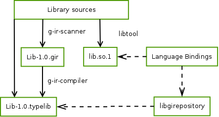

GObject Introspection: Metadata Extraction & Binding Integration
================================================================

GObject is an object system for the C language. It makes it possible to write
object oriented code with C, including inheritance, interface and includes its
own type system on top of C. GObject has a focus on making it easy to use from
other languages and language systems and bindings exist for Javascript, Perl,
C++, C#, Python and many more.

In addition to making binding creation easy it also tries to minimize the
needed maintenance work of bindings by moving all the needed logic into
GObject and the C code and automate the binding creation as much as possible.
This process is called GObject Introspection.

    GObject Introspection Process

The GObject Introspection process consists of two tools for extracting meta
data from C code and the compiled library as well as a library for interfacing
with the resulting meta data in bindings (:numref:`gir`).

The ``g-ir-scanner`` tool is responsible for extracting all the needed meta
data from GObject libraries and creates a XML file containing all this
information. These XML files are called GIR XML files or simply GIR (GObject
Introspection Repository) files. ``g-ir-scanner`` extracts the needed
information from the C header files and by introspecting the compiled library
directly. These GIR files are usually generated during the normal build
process of the library. For performance and memory efficiency reasons these
XML files are further converted using ``g-ir-compiled`` to a binary
representation called ``typelib`` which can be memory mapped and thus shared
between different processes.

With ``libgirepository`` exists a C library which provides a stable API for
the meta-data in the ``typelib`` files. Language bindings can use this library
to gather all needed information about a library at runtime or build time.
Each typelib defines a namespace identifier, which is a unique identifier for
the library as well as a version to allow API incompatible changes. For
example the GTK+ typelib has a namespace called ``Gtk`` and the versions
``2.0`` and ``3.0``. A typelib can also have multiple dependencies, meaning it
uses/references API from other typelibs and bindings need to load them as
well.

The contained meta data describes such things as types and their relation,
interfaces, object properties and signals, constants, closures etc. See the
`API documentation <https://developer.gnome.org/gi/stable/index.html>`__ for
more information.

To give an example on how a introspectable C function can look like:

.. code:: C

    /**
     * gtk_button_get_image:
     * @button: a #GtkButton
     *
     * Returns: (nullable) (transfer none): a #GtkWidget or %NULL in case
     *     there is no image
     *
     * Since: 2.6
     */
    GtkWidget *
    gtk_button_get_image (GtkButton *button)
    {
    ...

"gtk_button_get_image" only contains additional annotations for the return
type as everything else is either the default or inferred from the C
signature. "nullable" means that the function can return a NULL pointer and
"transfer none" means that the ownership of the passed object is not passed.
Ownership in this case means the responsibility of decreasing the reference
count, thus to caller has to increase the reference count if it wants to keep
the object alive.

Using ``g-ir-scanner`` we can get the GIR XML:

.. code:: XML

      <method name="get_image"
              c:identifier="gtk_button_get_image"
              version="2.6">
          <type name="Widget" c:type="GtkWidget*"/>
        </return-value>
        <parameters>
          <instance-parameter name="button" transfer-ownership="none">
            <doc xml:space="preserve">a #GtkButton</doc>
            <type name="Button" c:type="GtkButton*"/>
          </instance-parameter>
        </parameters>
      </method>

And finally using ``g-ir-compiled`` we can generate a typelib file which can
be used by PyGObject for example:

.. code:: pycon

    >>> from gi.repository import Gtk
    >>> button = Gtk.Button(image=Gtk.Image())
    >>> button.get_image()
    <Gtk.Image object at 0x7f38a182c280 (GtkImage at 0x559883c68140)>
    >>> 

When new API gets added to the C library it automatically becomes usable from
Python and other languages without the need to change the bindings themselves.
