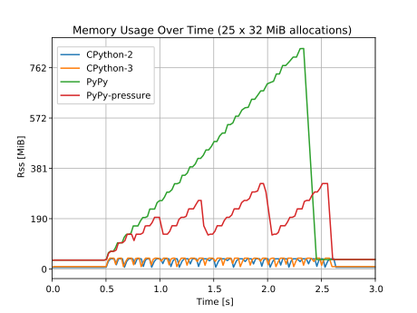

Resource Management and Garbage Collection
------------------------------------------

In some cases Python objects reference external resources, like for example
file like objects which reference a file descriptor provided by the kernel or
a image like object which references a memory block containing raw image data,
allocated using the system allocator. By default the kernel limits the amount
of file descriptors it gives out to processes to 1024 (see the output of
``ulimit -n``). Similarly memory is limited, but the kernel tries hard to
prevent it from running out by removing caches and unimportant processes. Thus
external resource should be released right after they are no longer needed.

There are two ways how to handle the releasing of resources: (1) Expose it as
a method of the object interface and require the user to manually release the
resources when no longer used.  This is currently the case with the
``close()`` method of file objects (2) Release the resource when the object is
finalized by the Python garbage collector, either in the special ``__del__``
protocol method or by using a weak reference callback. In CPython this is
often used as a fallback mechanism in case the explicit method was not used.

Tying the resource release to object finalization is not recommended because
the Python language documentation states (see "reference-counting scheme" at
https://docs.python.org/2/reference/datamodel.html) that there is no guarantee
when and if objects are finalized. This missing guarantee can become a problem
with PyPy when, for example, new file descriptors get created in a loop and
closing them is deferred to the object finalization procedure, which might
never happen as can be seen in the following demonstration:

::

    >>>> while 1:
    ....     open("newfile", "wb")
    ....
    [....]
    <open file 'newfile', mode 'wb' at 0x00007f8c2d461920>
    <open file 'newfile', mode 'wb' at 0x00007f8c2d4619a0>
    Traceback (most recent call last):
      File "<stdin>", line 2, in <module>
    IOError: [Errno 24] Too many open files: 'newfile'
    >>>> 

In practice the finalization process in CPython is mostly predictable and
deterministic. Only objects that are part of a reference cycle get not
finalized right away when they are no longer reachable. Due to this fact some
APIs don't provide an explicit method for releasing resources. One
disadvandage of explicit release is also that objects reach an invalid state
and can no longer be used. Care has to be taken that all remaining references
to the object are known and that nothing expects the object to be in a valid
state. This can be seen, for example, with file like objects, where any
operation on the object fails after it is marked closed and the file
descriptor is no longer valid.

Memory Leak Example
-------------------

Graph :numref:`gc_resource` shows an extreme example where the strategy of the
PyPy GC leads to memory usage problems. The graph shows the memory usage of a
program creating 25 objects where each object allocates 32 MiB and only frees
them when the object is finalized. A short waiting period after object
creation the last reference is deleted which makes the object unreachable. The
memory usage measured represents the RSS (Resident Set Size) of the whole
interpreter process. After the last allocation the GC is called explicitly to
collect and finalize all remaining objects.

The CPython interpreters in both version 2 and 3 ("CPython-2", "CPython-3")
finalize the objects right away and thus release the allocated memory. At no
point in time is there more than one allocation alive. In case of PyPy ("PyPy"
label) no memory gets freed until the final explicit invocation of the GC. The
default mark-and-sweep GC of PyPy will only starts a collection run if it
detects a certain amount of new allocations. Since the main memory allocation
by the Python object is done through the system allocator, which the PyPy GC
does not track, and the size of the tracked Python wrappers in memory is
small, the GC will not start collecting.

For this problem PyPy exposes a ``__pypy__.add_memory_pressure()`` function
which makes it possible to tell the PyPy GC about external allocations or
deallocations. The passed number will be used to adjust the memory allocation
threshold which influences the time of the next garbage collection cycle. The
case where all the allocations and deallocations are passed to
``add_memory_pressure`` is shown as "PyPy-presure" in :numref:`gc_resource`. A
similar functionality also exists for other languages, for example
`GC.AddMemoryPressure()
<https://msdn.microsoft.com/en-us/library/system.gc.addmemorypressure(v=vs.110).aspx>`__
in ".Net".

Preventing Resource Leakage with PyPy
-------------------------------------

To make resource management with PyPy more predictable and behave more like
CPython multiple strategies are possible:

Provide an API for manually releasing resources:
    Gives the user more control for when to release resources but also puts
    the object in an invalid state, meaning more responsibility and error
    handling needed from the user.

Pass memory allocation information to the PyPy GC:
    For every allocation and deallocation with a known size, call
    ``add_memory_pressure()``. Only applicable for memory allocations since
    the the PyPy GC strategy only works with memory allocations. In many cases
    the exact size of an allocated object is only known to the system
    allocator and not exposed through the API. The allocation size can also
    change over the lifetime of an object, for example when using lazy
    allocations or when resizing an allocation for a mutable object like an
    array.

Manually trigger a GC collection when an object becomes unreachable:
    In cases where objects which are known to allocate lots of external
    resources are no longer referenced by the user and don't provide a method
    for releasing those resouces the user can manually trigger a collection by
    calling ``gc.collect``. For this to work the user has to be sure that all
    references to the object are gone so it can be finalized and has to
    consider the performance implications of the GC run.

Monitor resource usage manually and force a collection on large increases:
    Similar to what the PyPy GC does for its own tracked allocations, one can
    monitor resource usage and trigger a garbage collection in case a specific
    threshold is reached. In case of system memory this means regularly
    retrieving the process memory usage through either ``mallinfo()`` or the
    information exposed in the special ``/proc`` filesystem. The downsides are
    that these interfaces are platform specific and they have to be called
    regularly, but not too often to not degrade performance. On the other hand
    such a system could also be used for other types of resources like GPU
    textures.

    This strategy is currently used in the Javascript GObject bindings
    (https://wiki.gnome.org/Projects/Gjs) where increases of the process RSS
    will be monitored and a GC collection is forced once a threshold is
    reached (see
    https://git.gnome.org/browse/gjs/commit/?id=7aae32d1df14af87e9a31c785447b27012b64af9
    for a relevant commit). A discussion regarding this strategy can be found
    in the archives of the gtk-devel-list mailing list:
    https://mail.gnome.org/archives/gtk-devel-list/2014-February/msg00027.html

    PyPy enhanced their garbage collector with version 2.2
    (http://doc.pypy.org/en/latest/release-2.2.0.html) to make the major
    collection part incremental and allowing to split the collection task in
    multiple smaller sub tasks. A incremental collection can be invoked by
    "gc.collect(genneration=1)" and should be safer to call periodically
    without introducing long delays.
