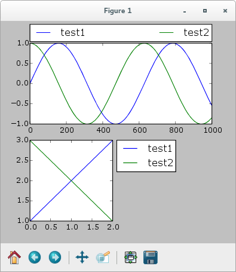

Implementation of PyPy Compatible GObject Bindings
==================================================

Based on the results of the implemented benchmarks we designed a new PyGObject
compatible library with support for PyPy called PGI. The primary goals of the
new implementation were full compatibility with PyGObject on all Python
versions and fast performance on both PyPy and CPython. While we could ignore
CPython in regards to performance it is vital to make it also a viable
alternative for CPython users. Firstly because most users use CPython which
makes it more likely to find contributors and secondly to make it easier to
switch to PyPy one library at a time and not force users to switch all
libraries not compatible with PyPy at once. The following design decisions
were made:

**Cache everything needed for marshaling.** On the first call of each method
function all the state that needs to be computed is cached forever. This
assumes that a program does only call a limited subset of all available
methods and thus the caching does not result in large memory usage. This
assumption was verified by modifying PyGObject to output all functions which
are called and record the output when starting with a larger application (the
audio player Quod Libet in version 3.8 was used). The startup of the
application resulted in 354 different functions getting called.

**Generate the marshaling code at runtime.** To make it possible to optimize
the marshaling code for each interpreter and Python version the code gets
generated at runtime. This allows to specialize code for Python 3 or for
CPython alone. As could be seen in the error handling and validation benchmark
the Python marshaling code makes up a major part of each call when CPython is
used and thus should be the focus of optimizations.

    PGI Overview Part 2/2

**Have multiple code generation backends** (:numref:`codegen`) **.** PGI
contains three code generation backends, one using ctypes, one using cffi and
one that does not generate any code called NULL backend. They can be changed
on a per function basis and allow PGI to use a different backend depending on
the Python version and interpreter used which again allows for better
performance. The NULL backend makes it possible to expose functions for which
not everything is implemented in other backends and is used for documentation
generation only, which will be described in a later section.

There currently exist two different versions of the Python language, Python 2,
which only receives bugfix releases but is still the most popular one (see
https://langui.sh/2016/12/09/data-driven-decisions/) and Python 3, which is
actively developed and not fully compatible with Python 2.

.. figure:: images/class.png
    :name: class
    :scale: 50%
    :align: center

    PGI Overview Part 1/2

PGI's implementation can be grouped into three parts (:numref:`class`)

* An API for accessing GLib and libgirepository to get all information needed
  for the binding generation. There currently exist two versions of this API
  in tree because, while cffi would be faster with PyPy, the import slowdown
  due to the parsing of C code, as mention in the benchmark section, increases
  the import time of the whole library too much. Thus the default API used in
  this part is ctypes at the moment.

* A code generation backend responsible for creating marshaling code for
  functions, methods, signals and callbacks.

* The rest which contains the dynamic import machinery, including the
  PyGObject API overrides and various implementations of functions which are
  not accessible through GObject Introspection.

PGI supports the following interpreter versions on Linux, Windows and macOS:

* CPython 2.7+ (Python 2)
* CPython 3.3+ (Python 3)
* PyPy 1.9+    (Python 2)
* PyPy3 2.4+   (Python 3)

Binding Example & Performance Evaluation
----------------------------------------

The following describes the process of writing a shared C library function and
calling it in PyPy using PGI. For this we use a function already provided by
the *gobject-introspection* test suite for performance testing. The method
"regress_test_obj_torture_signature_0" takes an instance of `RegressTestObj`
as the first argument and various in/out parameters with different basic
types. The following code snippet shows the function definition and the needed
annotations in the comment block above:

.. code-block:: c

    /**
     * regress_test_obj_torture_signature_0:
     * @obj: A #RegressTestObj
     * @x:
     * @y: (out):
     * @z: (out):
     * @foo:
     * @q: (out):
     * @m:
     *
     */
    void
    regress_test_obj_torture_signature_0 (RegressTestObj    *obj,
                                  int         x,
                                  double     *y,
                                  int        *z,
                                  const char *foo,
                                  int        *q,
                                  guint       m)

Using the ctypes code generation backend PGI generates the following code
which gets compiled to Python byte code at runtime and then cached on the
"TestObj" class. The values shown in the comments before the function
definition are contained in the function closure and are displayed there for
debugging purposes.

.. code-block:: python

    # dependencies:
    #   e19: <class 'pgi.codegen.funcgen.ReturnValue'>
    #   e1: (<type 'str'>, <type 'unicode'>)
    #   e14: <_FuncPtr object at 0x7f11f7bb5a10>
    #   e3: <module '__builtin__' (built-in)>
    #   e2: <module 'ctypes' from '/usr/lib/python2.7/ctypes/__init__.pyc'>
    # backend: ctypes
    def torture_signature_0(self, x, foo, m):
        '''torture_signature_0(x: int, foo: str, m: int) -> (y: float, z: int, q: int)'''

        # int32 type/value check
        if not e3.isinstance(x, e1):
            t4 = e3.int(x)
        else:
            raise e3.TypeError("torture_signature_0() argument 'x'(1): not a number")
        
        if not -2**31 <= t4 < 2**31:
            raise e3.OverflowError("torture_signature_0() argument 'x'(1): %r not in range" % t4)
        # new float
        t5 = e2.c_double()
        t6 = e2.byref(t5)
        t7 = e2.c_int32()
        t8 = e2.byref(t7)
        if e3.isinstance(foo, e3.unicode):
            t9 = foo.encode("utf-8")
        elif not isinstance(foo, e3.str):
            raise e3.TypeError("torture_signature_0() argument 'foo'(2): %r not a string" % foo)
        else:
            t9 = foo
        t10 = e2.c_int32()
        t11 = e2.byref(t10)
        # uint32 type/value check
        if not e3.isinstance(m, e1):
            t12 = e3.int(m)
        else:
            raise e3.TypeError("torture_signature_0() argument 'm'(3): not a number")
        
        if not 0 <= t12 < 2**32:
            raise e3.OverflowError("torture_signature_0() argument 'm'(3): %r not in range" % t12)
        # args: ['c_void_p', 'c_int', 'LP_c_double', 'LP_c_int', 'c_char_p', 'LP_c_int', 'c_uint']
        # ret: None
        t13 = self._obj
        t15 = e14(t13, t4, t6, t8, t9, t11, t12)
        t16 = t5.value
        t17 = t7.value
        t18 = t10.value
        return e19((t16, t17, t18))

This shows the function being called:

.. code-block:: pycon

    >>> from pgi.repository import Regress
    >>> test_obj = Regress.TestObj()
    >>> test_obj.torture_signature_0(5000, "foobar", 12345)
    (y=5000.0, z=10000, q=12351)

To compare the performance we call it 1000 times and do 6000 benchmark runs
while ignoring the first 3000 to exclude any JIT warmup effects:

======= ========= ========= ==========
VM      Library   Mean [ms] Stdev [ms]
======= ========= ========= ==========
CPython PyGObject 0.91911   0.03639
CPython PGI       6.38835   0.62356
PyPy    PGI       2.04760   0.93081
======= ========= ========= ==========

Our implementation is more than two times slower with PyPy and more than 6
times slower with CPython than PyGObject. For this particular function there
are still some optimizations possible, but it's unclear how much they would
affect the performance:

* Some methods on closure objects are looked up multiple times. As this is
  not optimized on CPython the methods could be cached in the closure as
  well.

* Not all type checking is needed. For many cases ctypes will raise if a wrong
  type is passed based on the set function signature. To still get a proper
  error messages pointing to the real cause including argument names the
  real cause could be computed in an exception handler.

* The code generated uses ctypes even though PGI prefers the cffi backend
  since the cffi backend does not implementing return values through pointers.
  Based on the benchmark comparing the FFI modules we can assume that cffi
  would be faster, especially when used under PyPy.

Status & Working Examples
-------------------------

While PGI is far from feature complete it can run various small example
applications. The git repository (https://github.com/lazka/pgi) contains an
examples directory with various working examples using GTK+, Clutter and
Cairo. For example the small application window with menu bars and context
menus as see in :numref:`gtk_menu_example`.

    An example program being run with PyPy and PGI. The code can be found in
    ``examples/gtk/menu_example.py``

The examples directory also contains code for using PGI as a matplotlib
backend. The `matplotlib plotting library <http://matplotlib.org/>`__ depends
on the CPython API, numpy, GTK+ 3 and pycairo. Using pgi instead of PyGObject,
cairocffi instead of pycairo and CPyExt to emulate the CPython API it is
possible to display and interact with simple plots as can be seen in
:numref:`matplotlib_example`.

    Matplotlib 1.4 compiled using CPyExt using PGI and cairocffi as a backend

Due to the incompleteness of PGI it is not yet feasible to create a full
featured GTK+ based user interfaces using PGI. A possible alternative was
explored with the `pypui <https://github.com/lazka/pypui>`__ framework which
uses PGI only to open a web application and serialize commands between the
Javascript and Python layers. An example application can be seen in
:numref:`pypui_example`.

    A simple demo application which passes data from the WebKit UI to PyPy
    which in turn displays it in a GtkDialog window.
