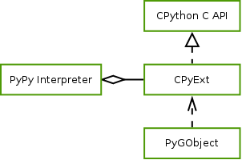

PyGObject
=========

PyGObject is the official Python binding for GObject Introspection. For a 
basic tutorial on how to use PyGObject see the `GTK+ tutorial 
<https://python-gtk-3-tutorial.readthedocs.or>`__.

To show how a PyGObject program might look like, the following code displays a
window using GTK+ and terminates the program when the window is closed:

::

    import gi
    gi.require_version("Gtk", "3.0")
    from gi.repository import Gtk

    window = Gtk.Window()
    window.show()
    window.connect("delete-event", Gtk.main_quit)
    Gtk.main()

It imports the "Gtk" namespace in version "3.0", creates a window and shows
it, connects the event that gets triggered when the window is closed to a
function stopping the main event loop and finally starts the event loop.

In addition to bindings, PyGObject also provides a set of module overrides.
These consist of one Python module per namespace and can include new
variables, new subclasses and setup code. For example, before GTK can be used,
``Gtk.init_check`` has to be called with the process arguments.
``Gtk.init_check`` will return a new filtered version of the argument list and
a boolean which indicates if the initialization process was successful. Since
this always needs to be done, it is included in the Gtk override module and
executed when the user imports the Gtk module.

::

    import sys

    initialized, argv = Gtk.init_check(sys.argv)
    sys.argv = list(argv)
    if not initialized:
        RuntimeError("Gtk couldn't be initialized")

Python classes can define various special methods that get called by the 
interpreter to integrate them with Python language concepts. For example, 
the Gtk.TreeModel defines ``__len__`` which gets called by the built-in 
``len`` function and returns the number of entries in the model. By 
defining ``__iter__`` and returning an iterator object, it is possible to 
iterate over a model: ``[row for row in model]``. These subclasses replace 
the original ones and every function returning a ``Gtk.TreeModel`` will 
return this new subclass instead.

::

    class TreeModel(Gtk.TreeModel):

        def __len__(self):
            return self.iter_n_children(None)

        def __iter__(self):
            return TreeModelRowIter(self, self.get_iter_first())

Another important use of override modules is to expose API that is not usable
through GObject Introspection and implemented in PyGObject itself instead. To
give an example of all the above features, the following script imports Gtk
without any initialization code, creates a ``Gtk.ListStore`` with one row of
the type ``TYPE_UINT64`` which is a constant defined in the overrides by
calling ``GObjectModule.type_from_name('guint64')``. Finally, since
``Gtk.ListStore`` is a subclass of the overridden ``Gtk.TreeModel`` which
defines ``__iter__``, it's possible to iterate over the containing values.

::

    from gi.repository import Gtk, GObject

    model = Gtk.ListStore(GObject.TYPE_UINT64)
    model.append(row=[42])

    for row in model:
        print row[0]

Since most of the overrides don't depend on PyGObject internals these
overrides can be shared with our alternative library implementation and allow
us to provide the same interfaces to the user.

Building with PyPy's C-API Compatibility Layer
----------------------------------------------

Since PyPy has a compatibility layer for C extensions called CPyExt we tried
to get PyGObject running (:numref:`cpyext`) with PyPy to have something to
compare the new implementation with. This work resulted in the following bugs
and patches being filed:

 * https://bugs.pypy.org/issue1434
 * https://bugzilla.gnome.org/show_bug.cgi?id=696646
 * https://bugzilla.gnome.org/show_bug.cgi?id=696648
 * https://bugzilla.gnome.org/show_bug.cgi?id=696650
 * https://bitbucket.org/pypy/pypy/pull-request/146

These changes make it possible to compile PyGObject against PyPy and load it.
Loading a library through PyGObject fails because of PyPy incompatibilities
outlined in the above `bug report <https://bugs.pypy.org/issue1434>`__. At the
time of this writing it's not clear how much more work is needed to get
PyGObject working with CPyExt and how it would compare performance wise. The
needed work could mean changing PyGObject to use different API which is easier
for PyPy to implement or just more commonly used and thus better supported, or
to improve the compatibility of PyPy's emulation layer.
